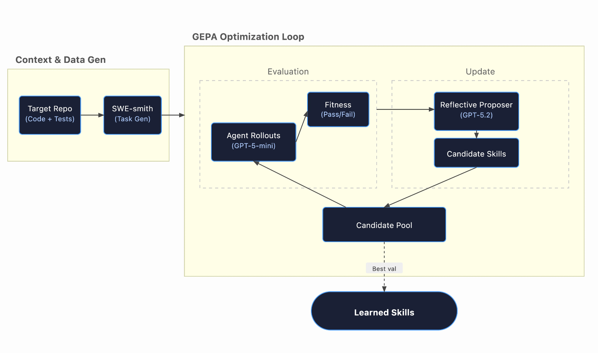

<h1 align="center">gskill: Learning Repository-Specific Skills for Coding Agents</h1>

<p align="center">
  <em>Given any GitHub repository, gskill creates important agent skill files for coding agents.</em>
</p>

## Overview

gskill learns repository-specific skills for coding agents. On a GitHub repository it automatically discovers the common patterns, structures, and debugging strategies that matter for that repo, then produces a skill file that makes agents better at fixing bugs in it.

It combines [SWE-smith](https://swesmith.com) for task generation and [GEPA's `optimize_anything`](https://gepa-ai.github.io/gepa/) for skill optimization:

1. **Generate tasks.** SWE-smith mines real commits from the target repo, introduces bugs, and produces hundreds of verifiable task instances, each with a problem statement, a Docker environment, and tests.

2. **Optimize skills.** GEPA starts with empty skills and runs the agent (mini-SWE-agent + gpt-5-mini on default) on batches of tasks in parallel Docker containers. Pass/fail results, agent traces, and test output go to a reflection model that proposes better skills. Repeat until budget is exhausted.

3. **Deploy.** The output is `best_skills.txt`, injected into the agent's system prompt. Skills transfer directly to other agents without retraining.

<p align="center">
  
</p>


## Installation

```bash
pip install gepa[full]
pip install swesmith mini-swe-agent docker python-dotenv
```

Set up API keys and Docker:

```bash
export OPENAI_API_KEY=<your-key>

# Docker must be running
docker ps

# Download SWE-smith images for target repo
python -m swesmith.build_repo.download_images
```

## Using gskill

### Training

```bash
# Smoke test
python -m gepa.gskill.train_optimize_anything \
  --smoke-test --model "gemini/gemini-2.0-flash-exp"

# Full run
python -m gepa.gskill.train_optimize_anything \
  --repo pygments__pygments \
  --train-size 200 --val-size 50 --test-size 100 \
  --model gpt-5-mini --reflection-model gpt-5.2-pro \
  --workers 6 --max-metric-calls 600 \
  --proposer loop --wandb

# Resume from a previous run
python -m gepa.gskill.train_optimize_anything \
  --resume gepa_results/logs/run_XXXXXXXX

# Pre/post optimization test comparison
python -m gepa.gskill.train_optimize_anything \
  --run-testset --repo pygments__pygments --model gpt-5-mini
```

| Flag | Default | Description |
|------|---------|-------------|
| `--repo` | `pygments__pygments` | Target repository in SWE-smith |
| `--model` | `gpt-5-mini` | Agent model (runs in Docker) |
| `--reflection-model` | `gpt-5.2-pro` | Model for reflection/skill proposal |
| `--workers` | 6 | Parallel Docker containers |
| `--max-metric-calls` | 600 | Total rollout budget |
| `--proposer` | `batch` | `batch` or `loop` (one-at-a-time then merge) |
| `--run-testset` | off | Evaluate before AND after optimization |
| `--resume` | None | Resume from previous run directory |
| `--smoke-test` | off | Quick validation with 3 tasks |
| `--wandb` | off | Enable Weights & Biases tracking |

### Evaluation

After training, evaluate learned skills on the held-out test set.

```bash
# Mini-SWE-agent: with skills vs without (runs both conditions)
python -m src.evaluate.mini_swe_agent \
  --config gepa_results/logs/run_xxx/config.json \
  --workers 16

# Claude Code: baseline (no skills)
python -m src.evaluate.claude_code \
  --config gepa_results/logs/run_xxx/config.json \
  --model haiku --workers 4

# Claude Code: with skills (copies best_skills.txt as CLAUDE.md)
python -m src.evaluate.claude_code \
  --config gepa_results/logs/run_xxx/config.json \
  --model haiku --workers 4 --use-skills

# Claude Code: with proper Claude Code Skills (.claude/skills/<repo>/SKILL.md)
python -m src.evaluate.claude_code_skills \
  --config gepa_results/logs/run_xxx/config.json \
  --model sonnet --workers 4 --use-skills
```

`evaluate/claude_code.py` builds a Docker image with Node.js + Claude Code on top of the SWE-smith base, runs `claude --print` with the problem statement, and verifies the patch with the same two-stage harness. `evaluate/claude_code_skills.py` is identical except it installs skills as a proper Claude Code skill (`.claude/skills/<repo>/SKILL.md` with YAML frontmatter) instead of a flat `CLAUDE.md`.

### Output

Results saved to `gepa_results/logs/run_<timestamp>_<id>/`:

- `best_skills.txt` - Learned skills
- `config.json` - Experiment configuration
- `iterations.jsonl` - Per-evaluation batch metrics
- `proposer_calls/` - Full proposer call logs
- `prompts/` - Each unique prompt version by hash
- `cost_summary.txt` - Cost breakdown (agent vs reflection)
- `gepa_state.bin` - State for resumption

## References

- [SWE-smith](https://swesmith.com)
- [mini-SWE-agent](https://github.com/SWE-agent/mini-swe-agent)
